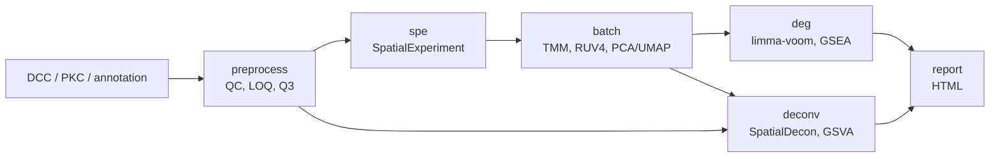

<h1 align="center">Bulk2Spot</h1>

<p align="center">
  <em>From GeoMx DSP raw counts to spatially resolved biology, in one reproducible workflow.</em>
</p>

<p align="center">
  <a href="https://github.com/mazzalab/Bulk2Spot/actions/workflows/ci.yml"></a>
  
  
  
  
</p>

---

**Bulk2Spot** is a [Snakemake](https://snakemake.readthedocs.io) workflow for
**NanoString GeoMx Digital Spatial Profiler (DSP)** RNA data. Every GeoMx region
(AOI/segment) is profiled like a small bulk RNA-seq sample. Bulk2Spot takes
these profiles from raw `.dcc` / `.pkc` / annotation files to quality control,
normalization, batch correction, differential expression, pathway enrichment
and cell-type deconvolution, and finishes with a single interactive HTML report.

## Features

| Stage | Target | What it does | Main tools |
|---|---|---|---|
| 1 | `preprocess` | Load DCC/PKC/annotation, segment + probe QC, LOQ filtering, Q3 normalization | GeomxTools |
| 2 | `spe` | Convert to a `SpatialExperiment`, add Patient / Scan / biology labels | standR |
| 3 | `batch` | RLE/PCA diagnostics, TMM normalization, optional RUV4 (+ limma) batch correction, PCA/UMAP | standR, scater, limma |
| 4 | `deg` | limma-voom DEG and GO/KEGG GSEA for every segment x comparison | limma, edgeR, clusterProfiler |
| 5 | `deconv` | Cell-type deconvolution (safeTME), proportion statistics, custom-signature GSVA | SpatialDecon, GSVA |
| 6 | `report` | Self-contained interactive HTML report | Python, Plotly |

- **One YAML file per project.** Every threshold, design choice and path lives in one config file.
- **Reproducible software.** Conda environments are built per rule from tested package pin files.
- **Laptop to HPC.** Runs locally, or submits one job per rule to PBS (built in) or any other
  scheduler (for example SLURM) with automatic retries that request more resources each time.
- **Robust to real data.** Works with any annotation schema and any comparison column. Steps that
  don't apply (e.g. no batch variable) produce clear placeholders instead of failing.



## Quick start

```bash
# 1. Get the code
git clone https://github.com/mazzalab/Bulk2Spot.git
cd Bulk2Spot

# 2. Create and activate the launcher environment (Snakemake)
conda env create -f environment.yml
conda activate bulk2spot

# 3. Try it on the tutorial dataset (~75 MB download)
tests/tutorial/download_tutorial_data.sh
./run.py -w report -c tests/tutorial/config_tutorial.yaml -n     # dry-run: shows the jobs
./run.py -w report -c tests/tutorial/config_tutorial.yaml -q 8   # run locally on 8 cores
```

On a PBS cluster, replace the last command with:

```bash
./run.py -w report -c tests/tutorial/config_tutorial.yaml -cl -qu workq -j 8
```

The first run builds the analysis environments automatically (R, Bioconductor, standR). This takes a
while, and only happens once. Open `tests/tutorial/output/results/report/bulk2spot_report.html` in a
browser when it is done.

Want to see the results first? [`examples/`](examples/README.md) has the outputs of this tutorial run:
the HTML report, QC and PCA figures, DEG/GSEA tables and plots, and deconvolution results.

## Analysing your own data

```bash
cp config/config.yaml my_project.yaml       # 1. copy the template
# 2. edit my_project.yaml: outputdir, raw-data paths, annotation columns, QC thresholds,
#    comparisons and segments (entries marked TODO)
./run.py -w preprocess -c my_project.yaml -n  # 3. dry-run
./run.py -w preprocess -c my_project.yaml -q 8
# 4. inspect results/preprocessing/QC_final.pdf, adjust thresholds if needed, then:
./run.py -w report -c my_project.yaml -q 8
```

## Documentation

| Document | Content |
|---|---|
| [Installation](docs/installation.md) | Requirements, environments, HPC setup, verification, troubleshooting |
| [Usage](docs/usage.md) | `run.py` reference, targets, local and cluster execution, re-runs |
| [Configuration](docs/configuration.md) | Every config option, with guidance on choosing values |
| [Outputs](docs/outputs.md) | Output tree and what each file contains |
| [Methods](docs/methods.md) | The analysis, step by step, with references |
| [Tutorial](tests/tutorial/README.md) | End-to-end run on NanoString's public kidney dataset |
| [Example outputs](examples/README.md) | The tutorial's report, figures and tables, ready to browse |

## Repository layout

```
Bulk2Spot/
├── run.py                    # launcher (wraps the Snakemake 7 API)
├── Snakefile                 # workflow entry point: targets, paths, environments
├── environment.yml           # launcher environment (Snakemake)
├── config/config.yaml        # project configuration template
├── workflow/
│   ├── rules/                # one .smk module per stage
│   ├── scripts/              # R analysis scripts (01-07), common.R, generate_report.py
│   └── envs/                 # conda environments + tested pin files + standR post-deploy
├── resources/signatures/     # bundled gene signatures (Jerby-Arnon et al. 2018)
├── tests/tutorial/           # tutorial config, data download script, walkthrough
├── examples/                 # example outputs from the tutorial run
└── docs/                     # documentation
```

## Citation

If you use Bulk2Spot, please cite this repository (see [`CITATION.cff`](CITATION.cff)) together with
the tools it builds on, listed in [docs/methods.md](docs/methods.md#references). The main ones are
GeomxTools, standR, limma, clusterProfiler, SpatialDecon and GSVA.

## Contributing

Bug reports and pull requests are welcome. See [CONTRIBUTING.md](CONTRIBUTING.md).

## License

MIT, see [LICENSE](LICENSE). The bundled Jerby-Arnon signature list comes from Jerby-Arnon *et al.*,
*Cell* 2018; cite the original publication when you use it.
