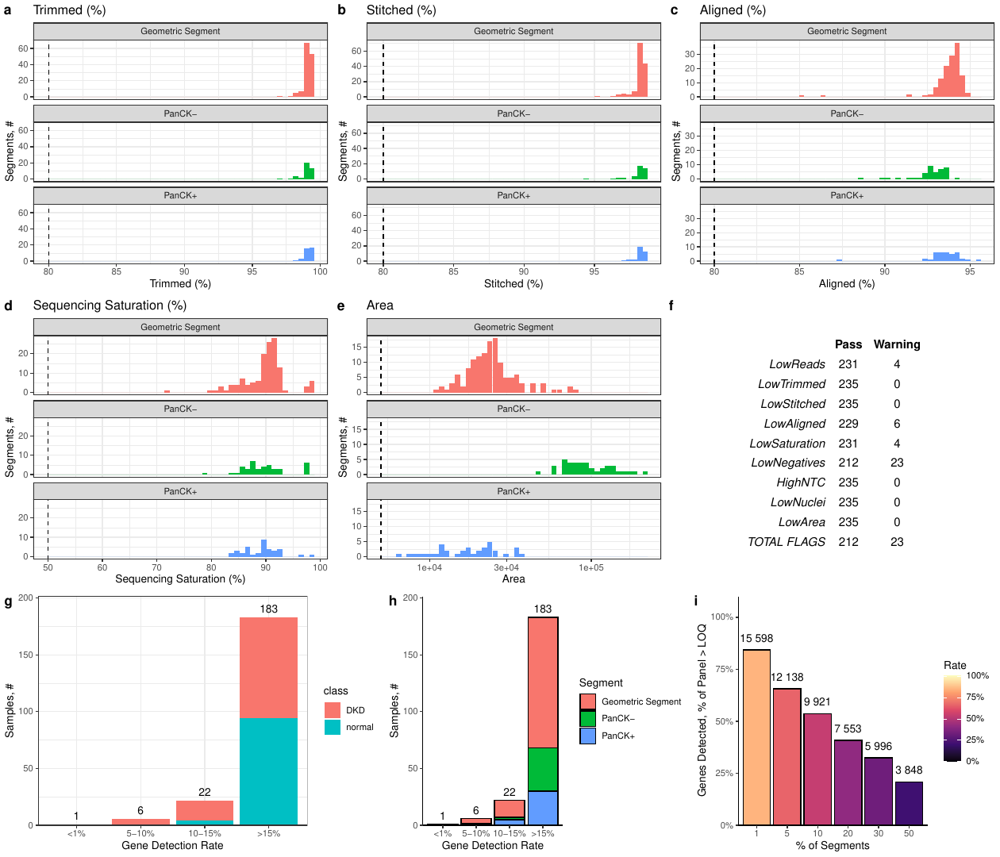
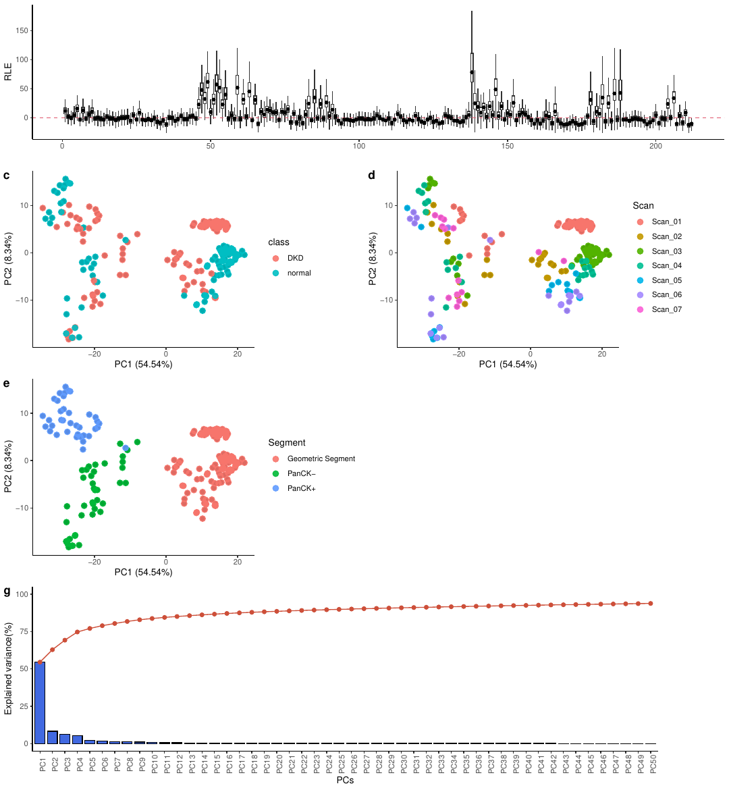
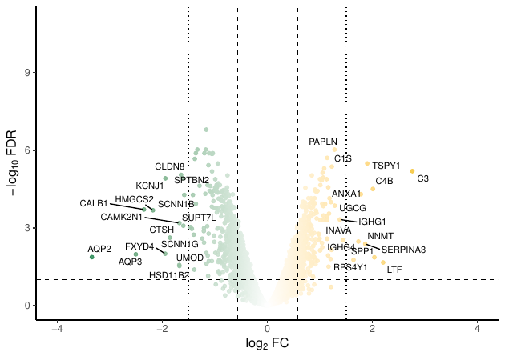
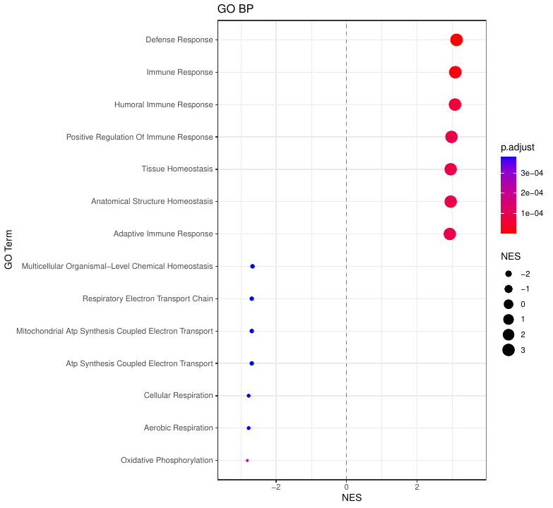
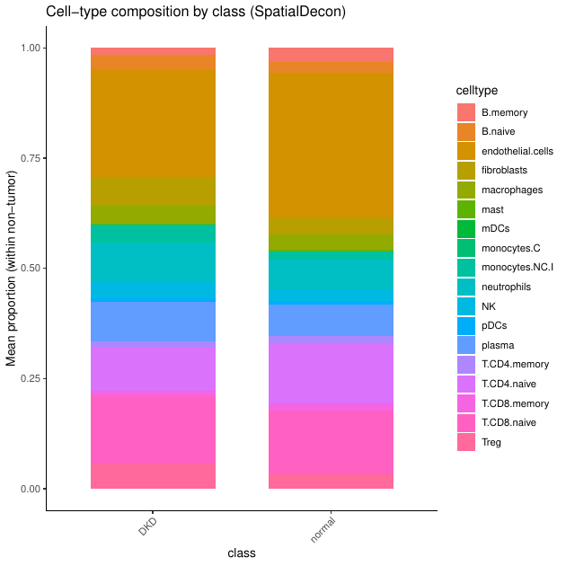
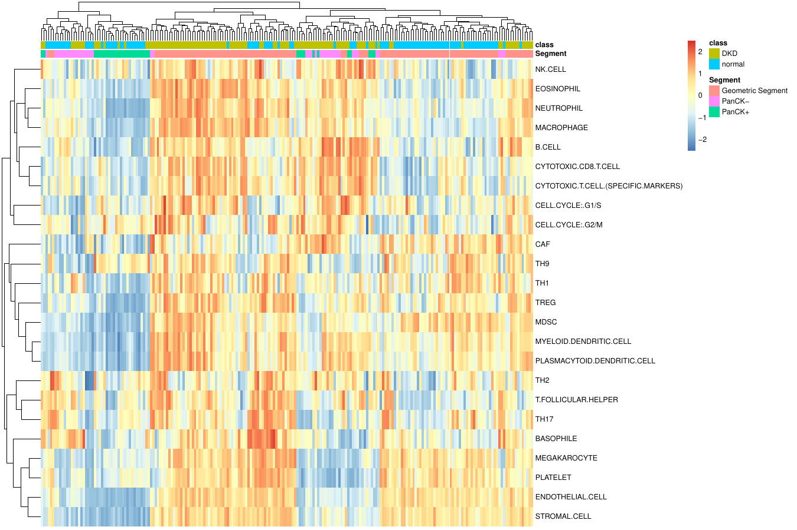

# Example outputs

`tutorial_output/` holds real Bulk2Spot outputs from the [tutorial](../tests/tutorial/README.md) run:
NanoString's public WTA kidney dataset, with Diabetic Kidney Disease (DKD) compared against normal
across 3 segment types. Browse them to see what the pipeline produces before you install anything.

It is a curated subset of `tests/tutorial/output/results/` with the same folder layout, so every path
below matches [docs/outputs.md](../docs/outputs.md). It has all the figures, summary tables and
DEG/GSEA workbooks. Large intermediate files are left out (`.rds` / `.RData` objects, full count
matrices, CIBERSORT inputs, ~100 MB); run the tutorial to get them. Batch correction is off in this
dataset, so its placeholder PDFs are also left out.

## Start here: the HTML report

[`tutorial_output/report/bulk2spot_report.html`](tutorial_output/report/bulk2spot_report.html)
(~7 MB, self-contained). GitHub shows HTML files as source code. To view the report, click
**Download raw file** on that page and open the file in a browser. It has QC funnels, sample
composition, PCA/UMAP, interactive volcano and GSEA plots for every segment, deconvolution and GSVA
results, the methods, and a glossary.

## At a glance

| Stage | Result on the tutorial data |
|---|---|
| QC | 212 of 235 segments pass; 9,922 genes x 212 segments after filtering and Q3 normalization |
| DEG (DKD vs normal) | Geometric Segment 279 up / 264 down; PanCK+ 398 / 393; PanCK- 86 / 136 |
| GSEA | GO BP terms: 120 / 229 / 69; KEGG pathways: 0 / 31 / 1 (same segment order) |
| Deconvolution | 212 ROIs x 18 safeTME cell types; 24 Jerby-Arnon signatures scored with GSVA |

<table>
  <tr>
    <td width="50%"><b>Preprocessing QC</b> (<code>preprocessing/QC_final.pdf</code>)<br>
      </td>
    <td width="50%"><b>RLE, PCA and scree plot</b> (<code>batch_correction/PCAScree_prebatch.pdf</code>)<br>
      </td>
  </tr>
  <tr>
    <td><b>Volcano plot, PanCK+</b> (<code>deg_gsea/DEG/PanCK+/DKD_vs_normal/</code>)<br>
      </td>
    <td><b>GO BP GSEA, PanCK+</b> (<code>deg_gsea/DEG/PanCK+/DKD_vs_normal/</code>)<br>
      </td>
  </tr>
  <tr>
    <td><b>Cell-type composition by class</b> (<code>deconvolution/stats/</code>)<br>
      </td>
    <td><b>GSVA signature scores</b> (<code>deconvolution/GSVA_Heatmap.pdf</code>)<br>
      </td>
  </tr>
</table>

The PNGs in `tutorial_output/previews/` are made from the PDFs for this page only. The pipeline
itself writes PDFs.

## Contents

```
tutorial_output/
├── report/bulk2spot_report.html
├── preprocessing/       QC_final.pdf, qc_summary_table.txt, QC_log.txt
├── spe/                 phenoData.txt (segment annotation)
├── batch_correction/    SampleInfo_Plot.pdf, PCAScree_prebatch.pdf, PCA/UMAP coordinates
├── deg_gsea/
│   ├── DEG_GSEA_summary.txt
│   └── DEG/<segment>/DKD_vs_normal/   TableDEG_*.xlsx, Volcano_*.pdf,
│                                      GSEA_*_results_*.xlsx, Dotplot*_*.pdf
├── deconvolution/       proportions.txt, composition barplots, GSVA heatmap and boxplots,
│                        stats/ and GSVA_stats/ (tests per class)
└── previews/            PNG versions of a few figures, for this page
```

## Reproducing

These files come from `./run.py -w report -c tests/tutorial/config_tutorial.yaml` using the pinned
environments in `workflow/envs/` (R 4.3.3, Bioconductor 3.18). DEG results are deterministic. GSEA
term counts can differ slightly between runs, because they use permutation p-values and KEGG data is
downloaded at run time. See the tutorial's
[Expected results](../tests/tutorial/README.md#expected-results).
